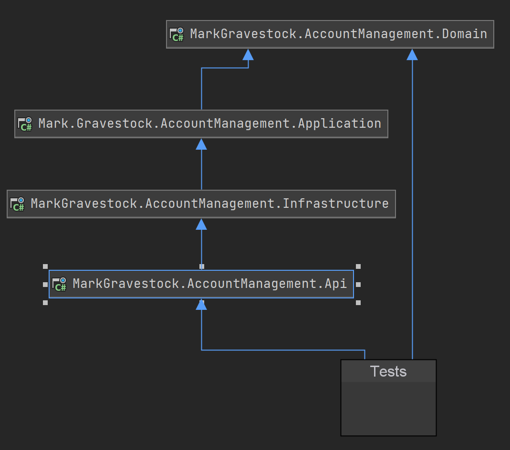

### Trivial Bank Account implementation 

#### Objectives

- Review current ASP.NET Core related tools and technologies
- Use a Hexagonal Architecture
    - This pattern was first proposed by Alistair Cockburn and is also known as the Ports and Adapters pattern, and aims to produce loosely coupled designs
    where direction of the coupling in the system is from the outer infrastructural concerns to the inner application. [DIP]
    
    
    
- Use Domain Driven Design tactical patterns for the Application and Domain Layers
    - This will be a made up domain model, normally this would be created

### Notes
    
- Create ASP.NET Core solution with following attributes
    - API Documentation using [OpenApi]() implmented by [Swashbuckle](https://github.com/domaindrivendev/Swashbuckle.AspNetCore)
    - Structured Logging using [Serilog]
        - Types of logging: Unstructured (strings), Structured (name-value pairs) and Domain (domain objects). Also consider the frequency of logging
    - Reporting Problem Details using [RFC7807] implemented by [Problem Details](https://github.com/khellang/Middleware)
    - Command/Query/Event dispatching implemented by [Mediatr]

### TODO

* Add test to test balance reflects initial balance on newly opened account
* Add test to test at controller level as the test diagnostics are not so good at the API level.

[ASP.NET Core Synchronisation Context or lack of](https://blog.stephencleary.com/2017/03/aspnetcore-synchronization-context.html)
    